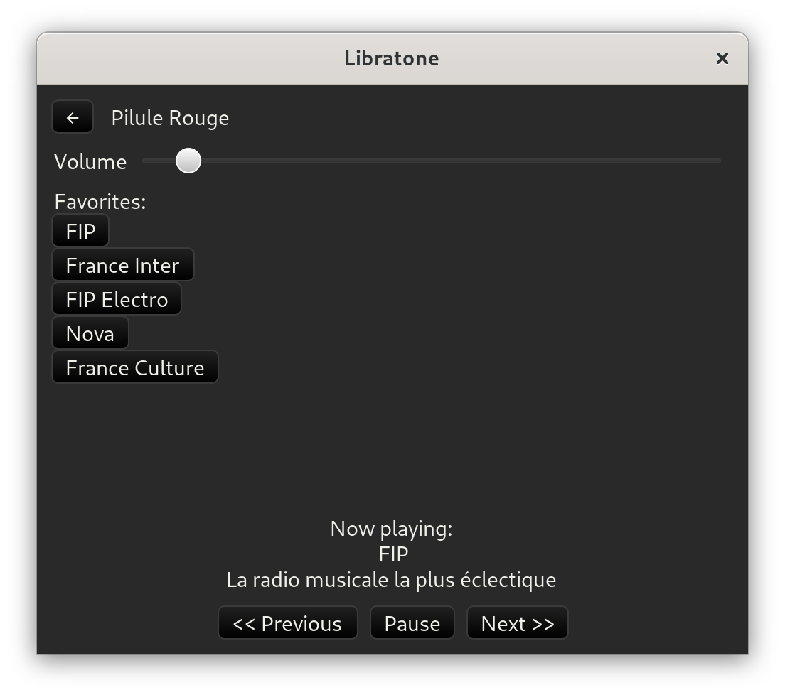

# libratone-rs

libratone-rs is a from-scratch implementation of the UDP protocol used to
control [Libratone](https://www.libratone.com/) speakers, at least the Zipp
Mini ones. It comes as a crate that can be used to control the device, and
ships a very basic UI as a demonstration.

While the code already implements [a number of commands](src/commands.rs), the
code was written as an exercise to practice Rust, and is therefore probably not
the most beautiful you'll read. I however use the UI on a daily basis, and it
has served me well so far.
